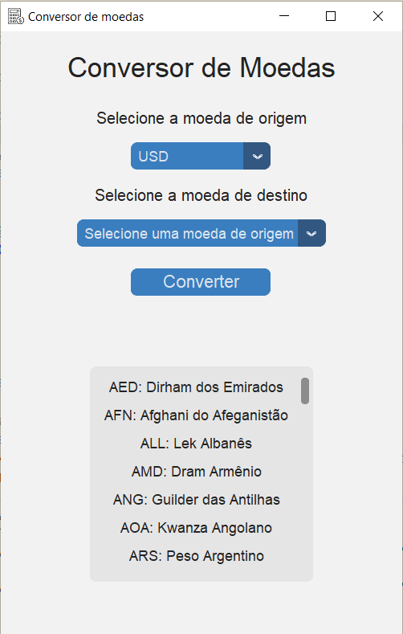

# Conversor de Moedas

Este projeto é um conversor de moedas desenvolvido em Python, utilizando as bibliotecas customtkinter, xmltodict e requests. O conversor permite ao usuário selecionar uma moeda de origem e uma moeda de destino para obter a taxa de câmbio atual entre as duas.

## Funcionalidades

- Seleção de moeda de origem e destino.
- Exibição da taxa de câmbio atual entre as moedas selecionadas.
- Lista de todas as moedas disponíveis e seus respectivos códigos.

## Instalação

Para a instalação deste aplicativo execute os passos abaixo.

### Pré-requisitos

Para executar este projeto, você precisa ter o Python instalado em sua máquina (foi utilizada a versão 3.12.4 na programação deste projeto), bem como as seguintes bibliotecas:

- customtkinter
- xmltodict
- requests

### Instalação das bibliotecas

Você pode instalar estas bibliotecas utilizando o pip:

```bash
  pip install customtkinter xmltodict requests
```

## Rodando localmente

Clone o projeto

```bash
  git clone https://github.com/wsabor/conversorMoedas
```

Instale as dependências

```bash
  pip install customtkinter xmltodict requests
```

Inicie o aplicativo

```bash
  python main.py
```

## Estrutura do Projeto

- main.py: script principal que contém a interface gráfica e lógica do conversor de moedas.
- pegar_moedas.py: módulo para obter os nomes e códigos das moedas disponíveis.
- pegar_cotacao.py: módulo para obter a cotação atual das moedas.

## Screenshots

!

## Aprendizados

Este projeto foi desenvolvido em conjunto com a turma de alunos das UCs Lógica de Programação e Sistemas Operacionais no V Itinerário da Escola SESI de Osvaldo Cruz - CE 283 usando como referência projeto semelhante disponível no canal Hashtag Programação.

## Autores

- [@wsabor](https://www.github.com/wsabor) - Instrutor de Formação Profissional do SENAI 9.14 "Santo Paschoal Crepaldi"
- [@IrineuFrancisco](https://www.github.com/irineufrancisco) - Instrutor de Formação Profissional do SENAI 9.14 "Santo Paschoal Crepaldi"
- Alunos do V Itinerário do SESI CE 283 e SENAI 9.14 "Santo Paschoal Crepaldi" de Presidente Prudente